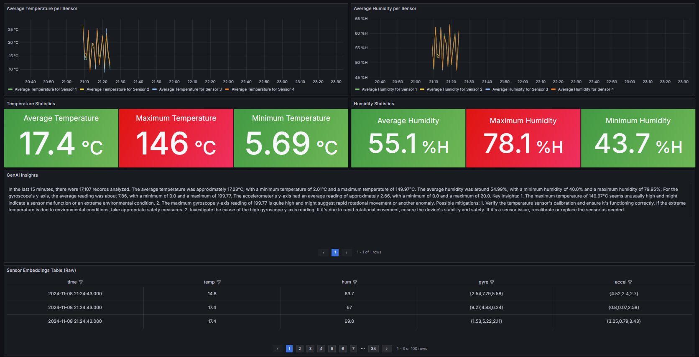

# MVP

## Quickstart
1. Setup [dataset generator](dummy-generator/README.md) to produce real-time continuous stream of simulation data to Kafka.
2. Setup [datastore](datastore/README.md) to consume simulation data in real-time and write them to SQL/Clickhouse datastore.
3. Setup [RAG](rag/README.md) to periodically analyze data from the last 15 minutes and generate key insights and observations from LLM.
4. Setup Grafana, create dashboard, then add SQL database as datasources.

## Example dashboard
  
